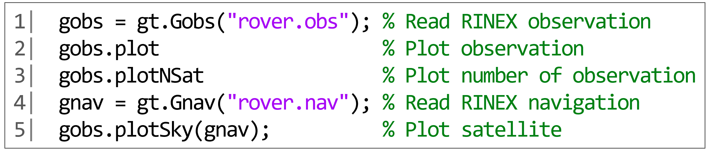

# Introduction
**MatRKTLIB** provides a MATLAB wrapper for [RTKLIB](https://github.com/tomojitakasu/RTKLIB), an open source GNSS data processing library, and also provides various processes required for actual GNSS analysis and research in its own MATLAB classes.

This porting facilitates the use of RTKLIB from within the MATLAB environment. In addition to the porting, MatRTKLIB offers editing functions for GNSS observations and visualization methods, which are frequently necessary in the processing of GNSS analysis. MATLAB, a programming language, has been particularly well-suited to educational and research purposes, particularly for novices, due to its ease of use for vector and matrix calculations, as well as its extensive visualization functions for calculation results. However, there has been no complete porting of RTKLIB to MATLAB. The arrival of MatRTKLIB is expected to greatly reduce the cost of entry for novices in GNSS studies and development. The features of the developed MatRTKLIB are as follows.

1. **MatRTKLIB** uses the RTKLIB source code as a submodule and compiles each RTKLIB function as an MEX function in C to provide calls in MATLAB, improving processing speed and allowing for immediate reflection of any feature additions to RTKLIB (e.g., support for new satellites/signals and support for new RINEX/RTCM versions).
2. Single-input/output RTKLIB functions were adapted to the vector input/output to suit MATLAB's unique vector/matrix processing; this allows for batch processing of the GNSS data analysis without iterative processing, improving execution speed and code readability.
3. Providing a unique MATLAB class called **GT**, which not only ports RTKLIB but also provides useful tools related to GNSS data processing, such as allowing easy editing of GNSS observation data, and computing linear combinations commonly used in GNSS data processing. GT also provides methods for visualizing various GNSS-related data using the visualization capabilities of MATLAB.
4. The source code for various concrete examples of GNSS data processing is provided. Many sample implementations will facilitate understanding of GNSS data processing, such as step-by-step implementations of linear combination generation, residual evaluation, single-point positioning, and PPK using the double differences of the GNSS carrier phases.

# GNSS Observation Model
As MatRTKLIB is based on RTKLIB, the GNSS observation model conforms to the observation model adopted in [RTKLIB manual](https://www.rtklib.com/prog/manual_2.4.2.pdf). However, GT provides methods for calculating GNSS pseudorange and carrier phase residuals for positioning calculations and GNSS analysis. In this section, the pseudorange and carrier phase residual models provided by MatRTKLIB are explained.

Let $\rho$ denote the GNSS pseudorange observation, and the residual model $v_\rho$ is expressed by the following equation.


where $r_r^s$ is the geometric distance between the antenna and the satellite, corrected for the Sagnac effect, and is calculated using `rtklib.geodist()`. The satellite position can be calculated using `rtklib.satposs()`, using broadcast ephemeris or precise ephemeris. $c$ is the speed of light, and $t_r$ is the receiver clock error. $I$ is the ionosphere delay, and can be calculated using the Klobuchar model, etc., using `rtklib.ionomodel()`. $T$ is the tropospheric delay, and it can be calculated using the Saastamoinen model with `rtklib.tropmodel()`. In GT, it is possible to calculate the pseudorange residuals shown in equation (1) all at once using the method for calculating the pseudorange observation residuals (`gobs.residuals()`).

Let $\phi$ denote the GNSS carrier phase observation, and the residual model $v_\phi$ is expressed by the following equation.

where, $\lambda$ is the wavelength of the carrier wave, $B$ is the bias of the carrier phase including the initial phase, and $\delta \phi$ is a correction term that includes the antenna phase center offset, the earth tide, and the phase wind-up effect. The carrier phase and pseudorange residuals can be used to estimate the position of the receiver antenna and for various other analyses.

Furthermore, GT provides `gobs.singleDifference()`, which calculates the difference between GNSS observations between reference stations, and `gobs.doubleDifference()`, which calculates the difference between observations between satellites. Using MatRTKLIB, it is possible to analyze these GNSS observation residuals and easily construct positioning methods, and it is expected to be used for various educational and research purposes.

# Requirement
**MatRTKLIB** was tested and compiled on the following

- MATLAB 2024a
- OS: Windows 11, 64bit, Compiler: Microsoft Visual Studio 2022
- OS: Ubuntu 20.04, 64bit, Compiler: GCC

**MatRTKLIB** supports MATLAB 2023a and higher and does not require a special toolbox. The recompiled MEX files are provided, they do not need to be recompiled, except in special cases.

# Installation
If you do not want to compile **MatRTKLIB** yourself, you can download a pre-compiled package:

```Shell
git clone https://github.com/taroz/MatRTKLIB.git
```

To install **MatRTKLIB**, simply add its folder path to your MATLAB path list in MATLAB comand window:

```python
addpath('/path/to/MatRTKLIB');
```

# Compile
For 32-bit systems, you will need to recompile **MatRTKLIB** yourself.
When compiling, clone including submodules.

```Shell
git clone --recursive https://github.com/taroz/MatRTKLIB.git
```

Or, if you have already cloned

```Shell
git submodule update --init --recursive
```

The compilation procedure is as follows.
1. In MATLAB, enter `mex -setup` to see if compiler is configured
2. Run `compile.m`

Note: If you are syncing directories via OneDrive or Dropbox, the compilation may fail. 
If this happens, please pause the synchronization.

# Usage
## Call RTKLIB functions
Use `rtklib.****` to call RTKLIB wrapper functions in MATLAB. Vector I/O is supported for many functions; see Appendix 1 for RTKLIB function support status and vector I/O support. You can also use the `doc rtklib.****' or `help rtklib.****' commands to get help on each function.

## GT
To create a GT object in MATLAB, use `gt.****`. See Appendix 2 for more information on GT class types and methods. You can also use the `doc gt.****' or `help gt.****' commands to get help on each function.


## Run examples
MatRTKLIB contains over 30 examples, all of which exist as MATLAB script files in the `/examples` folder. You can learn how to use the GT class by running the examples. See Appendix 3 for a description of the types and contents of the examples.

The examples folder contains a GNSS observation dataset for testing. Thus, all examples could be run without additional datasets.

The following are three example problems and their results.

### Example 1: Visualization of observation data
This example is provided as `Example1_visualization_RINEX_observation.m` in the examples folder. The specific source code for visualizing RINEX observations is shown in Fig. 1-1.

{width=80%}

As shown in Fig. 1, L1 creates a Gobs object by passing the RINEX observation file directly to the constructor of the Gobs class. L2 plots the satellite signals contained in the observation data, and the figure displayed in MATLAB is shown in Fig. 2. Similarly, L3 visualizes the number of satellite systems in the observation data (Fig. 3); L4 reads the RINEX navigation file and generates a Gnav object. L5 visualizes satellite constellations in the observation data by calculating the satellite positions using the receiver's approximate position in the RINEX observation file and navigation data (Fig. 4). Thus, MatRTKLIB can be used to concisely visualize signals in GNSS observations, changes in the number of satellites, and satellite constellations.

{width=50%}

{width=50%}

{width=50%}

### Example 2: Post-processing kinematic (PPK) analysis
This example is provided as `Example2_PPK_analysis.m` in the examples folder. The source code for PPK positioning using GNSS base station observations is shown in Fig. 5. 

{width=80%}

L1–L3 reads the RINEX observations and navigation data from the rover and reference station. L4 reads the configuration file, which is a processing option for RTKLIB, that contains the base station coordinates and analysis settings. L6–L7 calls the RTKPOS function of RTKLIB to perform PPK and generate a Gsol object, a class of positioning solutions. As shown on Figure 6, L8 represents the positioning solution. The green dots represent the FIX solution with resolved carrier-phase ambiguity and yellow dots represent the float solution. L9 outputs the computed solution to a file in RTKLIB solution format. Thus, MatRTKLIB facilitates performing positioning calculations and visualizing positioning solutions.

{width=50%}

### Example 3: GNSS position error analysis
This example is provided as `Example3_Positioining_error_analysis.m` in the examples folder. The source code for analyzing the errors in the positioning solution in Example 3 is shown in Figure 7.

{width=80%}

L1 creates a Gsol object by passing a positioning solution file through a Gsol class constructor. L2 is a process that makes the time interval of the solution constant. L3–L4 read the reference location from the CSV file to create the Gpos object. L5 created an object of class Gerr by subtracting the Gsol and Gpos objects. Several GT classes support intuitive subtraction. L6 shows the cumulative distribution function of the third-dimensional position error plotted using the Gerr class methods (Figure 8). The Gerr class also provides other useful methods for analyzing GNSS positioning errors, including calculating statistics and plotting various errors.

{width=50%}

\newpage

# Appendix 1: Supported RTKLIB functions
## Satellites, Systems, and Codes functions
| RTKLIB function name | Function | Ported | Vector input support| Note |
| ---- | ---- | ---- | ---- | ---- |
| satno        | Convert satellite system+prn/slot number to satellite number | ✔️ | ✔️ | |
| satsys       | Convert satellite number to satellite system | ✔️ | ✔️ | |
| satid2no     | Convert satellite id to satellite number | ✔️ | ✔️ | |
| satno2id     | Convert satellite number to satellite id | ✔️ | ✔️ | |
| obs2code     | Convert obs code string to obs code | ✔️ | ✔️ | |
| code2obs     | Convert obs code to obs code string | ✔️ | ✔️ | |
| code2freq    | Convert system and obs code to carrier frequency | ✔️ | ✔️ | |
| sat2freq     | Convert satellite and obs code to frequency | ✔️ | ✔️ | |
| code2idx     | Convert system and obs code to frequency index | ✔️ | ✔️ | |

## Time and String functions
| RTKLIB function name | Function | Ported | Vector input support| Note |
| ---- | ---- | ---- | ---- | ---- |
| tow2epoch    | Convert GPS time of week to calendar day/time | ✔️ | ✔️ | Function change from gpst2time |
| epoch2tow    | Convert calendar day/time to GPS time of week | ✔️ | ✔️ | Function change from time2gpst |
| gsttow2epoch | Convert Galileo time of week to calendar day/time | ✔️ | ✔️ | Function change from gst2time |
| epoch2gsttow | Convert calendar day/time to Galileo time of week | ✔️ | ✔️ | Function change from time2gst |
| bdttow2epoch | Convert BeiDou time of week to calendar day/time | ✔️ | ✔️ | Function change from bdt2time |
| epoch2bdttow | Convert calendar day/time to BeiDou time of week | ✔️ | ✔️ | Function change from time2bdt |
| gpst2utc     | Convert GPST epoch to UTC epoch | ✔️ | ✔️ | |
| utc2gpst     | Convert UTC epoch to GPST epoch | ✔️ | ✔️ | |
| gpst2bdt     | Convert GPST epoch to BDT epoch | ✔️ | ✔️ | |
| bdt2gpst     | Convert BDT epoch to GPST epoch | ✔️ | ✔️ | |
| epoch2doy    | Convert calendar day/time to day of year | ✔️ | ✔️ | Function change from time2doy |
| tow2doy      | Convert GPS time of week to to day of year | ✔️ | ✔️ | Function change from time2doy |
| utc2gmst     | Convert utc to GMST (Greenwich Mean Sidereal Time) | ✔️ | ✔️ | |
| adjgpsweek   | Adjust GPS week number using cpu time | ✔️ | ✔️ | |
| reppath      | Replace keywords in file path | ✔️ |  | |

## Coordinates transformation
| RTKLIB function name | Function | Ported | Vector input support| Note |
| ---- | ---- | ---- | ---- | ---- |
| xyz2llh      | Transform ECEF position to geodetic position | ✔️ | ✔️ | Function change from ecef2pos |
| llh2xyz      | Transform geodetic position to ECEF position | ✔️ | ✔️ | Function change from pos2ecef |
| xyz2enu      | Transform ECEF position to local ENU position | ✔️ | ✔️ | New development function |
| enu2xyz      | Transform local ENU position to ECEF position | ✔️ | ✔️ | New development function |
| enu2llh      | Transform local ENU position to geodetic position | ✔️ | ✔️ | New development function |
| llh2enu      | Transform geodetic position to local ENU position | ✔️ | ✔️ | New development function |
| ecef2enu     | Transform ECEF "vector" to local tangential coordinate | ✔️ | ✔️ | Function change from ecef2enu |
| enu2ecef     | Transform ENU "vector" to ECEF coordinate | ✔️ | ✔️ | Function change from enu2ecef |
| covenu       | Transform xyz-ECEF covariance to local ENU coordinate | ✔️ | ✔️ | |
| covenusol    | Transform xyz-ECEF covariance to local ENU coordinate | ✔️ | ✔️ | New development function |
| covecef      | Transform local ENU covariance to xyz-ECEF coordinate | ✔️ | ✔️ | |
| covecefsol   | Transform local ENU covariance to xyz-ECEF coordinate | ✔️ | ✔️ | New development function |
| eci2ecef     | Compute ECI to ECEF transformation matrix | ✔️ | ✔️ | |
| deg2dms      | Convert degree to degree-minute-second | ✔️ | ✔️ | |
| dms2deg      | Convert degree-minute-second to degree | ✔️ | ✔️ | |

## Input and Output functions
| RTKLIB function name | Function | Ported | Vector input support| Note |
| ---- | ---- | ---- | ---- | ---- |
| readpos      | Read positions from station position file | ✔️ | ✔️ | |
| readblq      | Read BLQ ocean tide loading parameters | ✔️ | ✔️ | |
| readerp      | Read earth rotation parameters | ✔️ | ✔️ | |
| geterp       | Get earth rotation parameter values | ✔️ | ✔️ | |

## Platform dependent functions
| RTKLIB function name | Function | Ported | Vector input support| Note |
| ---- | ---- | ---- | ---- | ---- |
| expath       | Expand file path with wild-card (*) in file | ✔️ |  | |

## Positioning models
| RTKLIB function name | Function | Ported | Vector input support| Note |
| ---- | ---- | ---- | ---- | ---- |
| satazel      | Compute satellite azimuth/elevation angle | ✔️ | ✔️ | |
| geodist      | Compute geometric distance and receiver-to-satellite unit vector | ✔️ | ✔️ | |
| dops         | Compute DOP (dilution of precision) from azimuth and elevation | ✔️ | ✔️ | |

## Atmosphere models
| RTKLIB function name | Function | Ported | Vector input support| Note |
| ---- | ---- | ---- | ---- | ---- |
| ionmodel     | Compute ionospheric delay by broadcast ionosphere model (klobuchar model) | ✔️ | ✔️ | |
| ionmapf      | Compute ionospheric delay mapping function by single layer model | ✔️ | ✔️ | |
| ionppp       | Compute ionospheric pierce point (ipp) position and slant factor | ✔️ | ✔️ | |
| tropmodel    | Compute tropospheric delay by standard atmosphere and saastamoinen model | ✔️ | ✔️ | |
| tropmapf     | Compute tropospheric mapping function by NMF | ✔️ | ✔️ | |
| iontec       | | WIP | | |
| readtec      | | WIP | | |
| ionocorr     | Compute ionospheric correction | ✔️ | ✔️ | |
| tropcorr     | Compute tropospheric correction | ✔️ | ✔️ | |

## Antenna models
| RTKLIB function name | Function | Ported | Vector input support| Note |
| ---- | ---- | ---- | ---- | ---- |
| readpcv      | Read antenna parameters | ✔️ | | |
| searchpcv    | Search antenna parameter | ✔️ | | |
| antmodel     | Compute receiver antenna offset by antenna phase center parameters | ✔️ | ✔️ | |
| antmodel_s   | Compute satellite antenna offset by antenna phase center parameters | ✔️ | ✔️ | |

## Earth tide models
| RTKLIB function name | Function | Ported | Vector input support| Note |
| ---- | ---- | ---- | ---- | ---- |
| sunmoonpos   | Get sun and moon position in ECEF | ✔️ | ✔️ | |
| tidedisp     | Compute displacements by earth tides | ✔️ | ✔️ | |

## Geiod models
| RTKLIB function name | Function | Ported | Vector input support| Note |
| ---- | ---- | ---- | ---- | ---- |
| geoidh       | Get geoid height from geoid model | ✔️ | ✔️ | |

## Datum transformation
| RTKLIB function name | Function | Ported | Vector input support| Note |
| ---- | ---- | ---- | ---- | ---- |
| tokyo2jgd    | Transform position in Tokyo datum to JGD2000 datum | ✔️ | ✔️ | |
| jgd2tokyo    | Transform position in JGD2000 datum to Tokyo datum | ✔️ | ✔️ | |

## RINEX functions
| RTKLIB function name | Function | Ported | Vector input support| Note |
| ---- | ---- | ---- | ---- | ---- |
| readrnxobs   | Read RINEX observation file | ✔️ | | Function change from readrnx |
| readrnxnav   | Read RINEX navigation file | ✔️ | | Function change from readrnx |
| outrnxobs    | Output RINEX observation file | ✔️ | | outrnxobsh+outrnxobsb|
| outrnxnav    | Output RINEX navigation file | | ✔️ | | outrnxnavh+outrnxnavb|
| readrnxc     | Read RINEX clock files | ✔️ | | |
| convrnx      | | WIP | | |

## Ephemeris and clock functions
| RTKLIB function name | Function | Ported | Vector input support| Note |
| ---- | ---- | ---- | ---- | ---- |
| eph2clk      |  Compute satellite clock bias with broadcast ephemeris (GPS, GAL, QZS, BDS, IRN) | ✔️ | ✔️ | |
| geph2clk     | Compute satellite clock bias with GLONASS ephemeris | ✔️ | ✔️ | |
| seph2clk     | | WIP | | |
| eph2pos      | Compute satellite position and clock bias with broadcast ephemeris (GPS, GAL, QZS, BDS, IRN) | ✔️ | ✔️ | |
| geph2pos     | Compute satellite position and clock bias with GLONASS ephemeris | ✔️ | ✔️ | |
| seph2pos     |  | WIP | | |
| peph2pos     | Compute satellite position/clock with precise ephemeris/clock | ✔️ | ✔️ | |
| satantoff    | Compute satellite antenna phase center offset in ECEF coordinate
| ✔️ | ✔️ | |
| satpos       | Compute satellite position, velocity and clock | ✔️ | ✔️ | |
| satposs      | Compute satellite position, velocity and clock | ✔️ | ✔️ | |
| readsp3      | Read SP3 file | ✔️ | | |
| readsap      | Read satellite antenna parameters | ✔️ | | |
| readdcb      | Read differential code bias (DCB) parameters | ✔️ | | |
| alm2pos      | | WIP | | |
| tle_read     | | WIP | | |
| tle_name_read| | WIP | | |
| tle_pos      | | WIP | | |

## RTCM functions
| RTKLIB function name | Function | Ported | Vector input support| Note |
| ---- | ---- | ---- | ---- | ---- |
| gen_rtcm2    | | WIP | | |
| gen_rtcm3    | | WIP | | |

## Solution functions
| RTKLIB function name | Function | Ported | Vector input support| Note |
| ---- | ---- | ---- | ---- | ---- |
| readsol      | Read rtklib solution file | ✔️ | | |
| readsolstat  | Read rtklib solution status file | ✔️ | | |
| outsol       | Output rtklib solution file | ✔️ | | |
| outsolex     | | WIP |  | |
| outnmea_rmc  | | WIP |  | |
| outnmea_gga  | | WIP |  | |
| outnmea_gsv  | | WIP |  | |

## Google earth kml/gpx converter
| RTKLIB function name | Function | Ported | Vector input support| Note |
| ---- | ---- | ---- | ---- | ---- |
| convkml      | Convert from solution files to Google Earth KML files | ✔️ |  | |
| convgpx      | Convert from solution files to GPX files | ✔️ |  | |

## SBAS functions
| RTKLIB function name | Function | Ported | Vector input support| Note |
| ---- | ---- | ---- | ---- | ---- |
| sbsreadmsg   | | WIP | | |
| sbssatcorr   | | WIP | | |
| sbsioncorr   | | WIP | | |
| sbstropcorr  | | WIP | | |

## Options functions
| RTKLIB function name | Function | Ported | Vector input support| Note |
| ---- | ---- | ---- | ---- | ---- |
| loadopts     | Load option struct | ✔️ | | |
| saveopts     | Save option struct | ✔️ | | |

## Integer ambiguity resolution
| RTKLIB function name | Function | Ported | Vector input support| Note |
| ---- | ---- | ---- | ---- | ---- |
| lambda       | Integer least-square estimation | ✔️ | WIP | |

## Standard positioning
| RTKLIB function name | Function | Ported | Vector input support| Note |
| ---- | ---- | ---- | ---- | ---- |
| pntpos       | Compute receiver position, velocity, clock bias by single-point positioning | ✔️ | ✔️ | |

## Precise positioning
| RTKLIB function name | Function | Ported | Vector input support| Note |
| ---- | ---- | ---- | ---- | ---- |
| rtkinit      | Initialize RTK control struct| ✔️ | | |
| rtkpos       | Compute rover position by precise positioning | ✔️ | ✔️ | |

## Precise point positioning
| RTKLIB function name | Function | Ported | Vector input support| Note |
| ---- | ---- | ---- | ---- | ---- |
| pppos        | | WIP | | |

\newpage

# Appendix 2: GT Classes
| Class name | Function |
| ---- | ---- |
| Gobs	| GNSS observation: read/edit/write/visualization |
| Gnav	| GNSS navigation: read/edit/write/visualization |
| Gtime	| GPS time: time system conversion |
| Gpos	| Geodetic position: coordinate system conversion |
| Gvel	| Velocity: coordinate system conversion |
| Gcov	| Covariance: coordinate system conversion |
| Gsat	| Satellite-related data: edit/visualization |
| Gsol	| Position solution: read/edit/write/visualization |
| Gstat	| Position status: read/edit/write/visualization |
| Grtk	| RTK control class |
| Gopt	| Process option: read/edit/write |
| Gfun  | Wrapper for positioning function |
| C	    | Define constants |

\newpage

# Appendix 3: Examples
| File | Description |
| ---- | ---- |
| compute_double_difference.m                | Compute double-differenced GNSS observation |
| compute_fixrate.m                          | Compute ambiguity fixed rate from RTK-GNSS solution |
| compute_float_ambiguity.m                  | Compute double-differenced float carrier phase ambiguity |
| compute_geoid.m                            | Compute Geoid and orthometric hight |
| compute_mean_position.m                    | Compute mean position from solution file |
| compute_residuals_doppler.m                | Compute Doppler residuals |
| compute_residuals_pseudorange.m            | Compute pseudorange residuals |
| convert_coordinate.m                       | Convert LLH, ECEF and ENU position to each other |
| convert_solution_to_kml.m                  | Convert positioning solution to Google Earth KML file |
| convert_time.m                             | Convert GPS time, calender time and UTC time to each other |
| edit_rinex_observation1.m                  | Read and write RINEX observation |
| edit_rinex_observation2.m                  | Trim RINEX observation using time span |
| edit_rinex_observation3.m                  | Modify RINEX observation interval |
| edit_rinex_observation4.m                  | Exclude satellites from RINEX observation |
| edit_solution.m                            | Read position solution file and trim solution |
| estimate_position_rtk.m                    | RTK-GNSS positioning using RTKLIB |
| estimate_position_rtk_step_by_step.m       | Step by step example of RTK-GNSS positioning |
| estimate_position_spp.m                    | Single point positioning using RTKLIB |
| estimate_position_spp1_step_by_step.m      | Step by step example of single point positioning |
| estimate_position_spp2_step_by_step.m      | Step by step example of single point positioning |
| estimate_velocity_doppler_step_by_step.m   | Step by step example of velocity estimation by Doppler |
| estimate_velocity_tdcp_step_by_step.m      | Step by step example of velocity estimation by TDCP |
| evaluate_position_error.m                  | Evaluate positioning accuracy and plot error |
| evaluate_velocity_error.m                  | Evaluate velocity accuracy and plot error |
| Example1_visualization_RINEX_observation.m | Visualization of RINEX observation in GPS solutions paper |
| Example2_PPK_analysis.m                    | Post-processing kinematic example in GPS solutions paper |
| Example3_Positioning_error_analysis.m      | Positioning error analysis in GPS solutions paper |
| generate_configuration_file.m              | Generate RTKLIB configuration file |
| generate_solution_file.m                   | Generate RTKLIB solution file |
| plot_observation1.m                        | Show observation status and number of satellite |
| plot_observation2.m                        | Show raw GNSS measurements |
| plot_position.m                            | Show position on map |
| plot_satellite_constellation1.m            | Show satellite constellation |
| plot_satellite_constellation2.m            | Show satellite elevation and azimuth angles |
| plot_solution.m                            | Show RTK position solutions |
